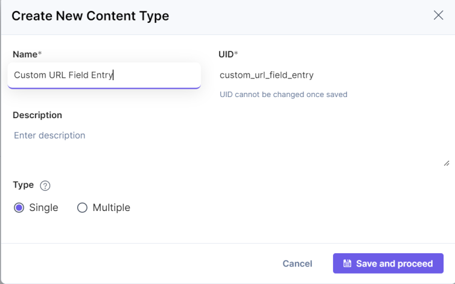

# Contentstack Custom URL field App
This field auto-generates the url based on the title changes.

## Prerequisite

-   [Contentstack Account](https://app.contentstack.com/#!/login)
-   `Nodejs` - v14.18.2 & `NPM` - 8.1.4

Clone the git repository to your local machine. The app source folder will be referred as APP_DIRECTORY from now on.

## Install Dependencies

-   In the terminal go to APP_DIRECTORY and install the necessary packages :

```
cd <APP_DIRECTORY>
npm i
```

-   To install the necessary packages for ui , navigate to the ui folder

```
cd <APP_DIRECTORY>/ui
npm i
```

-   After you install the packages, run the following command in the ui folder to get started:

```
npm run start
```

The UI server will start at port 4000.


## Creating an app in Developer Hub/Marketplace
-  Go to developer hub at https://app.contentstack.com/#!/developerhub
-  Create a new app by clicking + New App button at top right and Select app type as Stack App, add name and description.
- After creating an app, you will be redirected to the Basic Information page. Add the icon for your app.
- Open the UI Locations tab and add the URL of your app. For e.g. : http://localhost:4000/#. 
  We are adding ` # ` in the URL as We are using React HashRouter for Routing.
- From Available location(s) , add Custom Field. For Custom Field, add name and path. The value of path should be ` /custom-field `.  Switch on the toggle for Enabled to enable the Custom Field location. Select the  Data Type as a Text. Add the description if required.
- Now install the app by clicking the Install App button at top right. From the next window, select the stack in which you want to install the app.


Note : You can give any path values but make sure the path value in `<APP_DIRECTORY>/ui/src/containers/App/index.tsx` and in UI location should be the same.

## Use Custom URL field app within your stack
- Follow the steps given below to use this app using a Custom field:
- Go to your stack and click the **Content Models** icon on the left navigation panel, and click the **+ New Content Type** button.
- Create a content type by adding relevant details and click **Save and proceed**.

<kbd></kbd>
- In the Content Type Builder page, add a Custom field in your content type by clicking the **Insert a field** link represented by a + sign.
- Under Select Extension/App, select **Custom URL field** (that you have created in above step) and then click **Proceed**. 

<kbd></kbd>
- After adding the app, click **Save or Save and Close** to save your changes.
- To use the **Custom URL Field app**, create an entry for the above content type, and you will see the app in your entry page as shown below: 

<kbd></kbd>
- Now Add the title in Title field of entry. You can see auto-generated url in the above custom field.

<kbd></kbd>
- On Click of "eye" icon present in the Input box of the Custom URL field, A Modal will get opened which has all the list of URL's related to Environments present in stack. 

<kbd></kbd>
 

## Source code file locations for various ui location

* After the app is installed, you can refer to the pages developed at various UI locations in the stack. Below are the various UI locations and their corresponding page in source code:

|UI Location      | Page Source                                                 |
|------------     |-------------                                                |
|Custom Field     |<APP_DIRECTORY>/ui/src/containers/CustomField/index.tsx      |

* You can refer to the changes in UI now at corresponding places as mentioned above.
